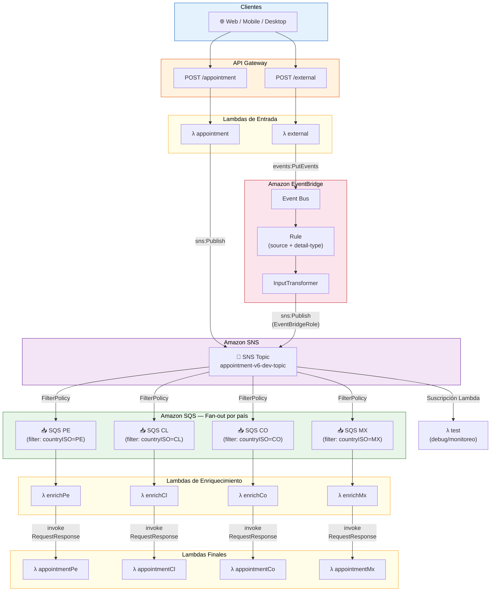

# Sistema de Citas Médicas v6 - Arquitectura con EventBridge, SNS y SQS (Orquestación de Eventos + Fan-out + Enriquecimiento)

## Descripción

Este proyecto implementa un sistema de gestión de citas médicas usando AWS Lambda, **Amazon EventBridge**, **Amazon SNS** y **Amazon SQS**. Esta versión introduce **Amazon EventBridge** como orquestador central de eventos, permitiendo recibir eventos desde múltiples fuentes externas (web, mobile, desktop) y enrutarlos hacia el pipeline existente de SNS + SQS. Mantiene el patrón **Fan-out** con filtrado de mensajes, **enriquecimiento de datos asíncrono** y **tipado fuerte de TypeScript**.

## Arquitectura

El sistema implementa una arquitectura **Event-Driven** con EventBridge como orquestador y SNS como bus de distribución:

### Diagrama de Infraestructura



### Funciones Lambda

**Funciones de Entrada (HTTP):**
- **appointment**: Endpoint POST `/appointment` — publica directamente en el tópico SNS
- **external**: Endpoint POST `/external` — publica eventos en EventBridge, que los enruta hacia SNS

**Función de Prueba:**
- **test**: Suscrita directamente al tópico SNS (protocolo Lambda) para monitoreo/debugging

**Funciones de Enriquecimiento (reciben eventos de SQS):**
- **appointmentEnrichPe**: Enriquece datos e invoca `appointmentPe` para Perú (PE)
- **appointmentEnrichCl**: Enriquece datos e invoca `appointmentCl` para Chile (CL)
- **appointmentEnrichCo**: Enriquece datos e invoca `appointmentCo` para Colombia (CO)
- **appointmentEnrichMx**: Enriquece datos e invoca `appointmentMx` para México (MX)

**Funciones Finales (invocadas síncronamente vía `RequestResponse`):**
- **appointmentPe**: Procesa citas médicas finales para Perú
- **appointmentCl**: Procesa citas médicas finales para Chile
- **appointmentCo**: Procesa citas médicas finales para Colombia
- **appointmentMx**: Procesa citas médicas finales para México

### Recursos AWS

- **1 EventBridge Event Bus**: Bus personalizado para recibir eventos externos
- **1 EventBridge Rule**: Filtra eventos por `source` y `detail-type`, con `InputTransformer` para extraer el `detail`
- **1 Tópico SNS**: `TopicAppointment` — bus de distribución fan-out
- **1 Suscripción SNS directa**: Protocolo Lambda hacia la función `test`
- **4 Colas SQS**: Una por cada país (sqs-pe, sqs-cl, sqs-co, sqs-mx)
- **4 Suscripciones SNS a SQS**: Con filtros por `countryISO` para enrutar mensajes
- **1 Rol IAM para EventBridge**: Permite a la regla publicar en el tópico SNS
- **API Gateway**: Endpoints HTTP POST `/appointment` y `/external`

### Flujos de Trabajo

#### Flujo Directo (POST /appointment)

1. Cliente envía petición HTTP POST a `/appointment`
2. La función `appointment` publica el mensaje directamente en el tópico SNS
3. SNS evalúa las políticas de filtro (`FilterPolicy`) de cada suscripción
4. SNS enruta el mensaje a las colas SQS que coincidan con el filtro (según `countryISO`)
5. Las funciones **Enrich** por país se activan automáticamente desde SQS
6. Enriquecen los datos (agregando `historyNumber`, `enriched`, `enrichedAt`)
7. Invocan síncronamente las funciones finales específicas por país
8. Procesan la cita médica de forma desacoplada e independiente

#### Flujo EventBridge (POST /external)

1. Cliente envía petición HTTP POST a `/external`
2. La función `external` publica un evento en **EventBridge** con `source` y `detail-type`
3. EventBridge evalúa la **Rule** configurada (filtra por `source` y `detail-type`)
4. La regla usa un **InputTransformer** para extraer solo el `detail` del evento
5. EventBridge envía el mensaje transformado al tópico SNS (target)
6. A partir de aquí, el flujo continúa igual que el flujo directo (pasos 3-8)

### Regla de EventBridge

La regla acepta eventos que coincidan con el siguiente patrón:

```json
{
  "source": ["web-app", "mobile-app", "desktop-app"],
  "detail-type": ["appointment-create", "appointment-cancel"]
}
```

El **InputTransformer** extrae los campos individuales del `detail` del evento y construye un JSON válido para enviar al tópico SNS:

```yaml
InputTransformer:
  InputPathsMap:
    slotId: "$.detail.slotId"
    patientId: "$.detail.patientId"
    date: "$.detail.date"
    countryISO: "$.detail.countryISO"
  InputTemplate: '{"slotId": <slotId>, "patientId": <patientId>, "date": "<date>", "countryISO": "<countryISO>"}'
```

## Estructura del Proyecto

```
src/
├── handlers/
│   ├── external.ts              # Punto de entrada EventBridge
│   ├── appointment.ts           # Punto de entrada SNS directo
│   ├── test.ts                  # Suscriptor directo SNS (debug)
│   ├── appointment-enrich-pe.ts # Enriquecimiento Perú
│   ├── appointment-enrich-cl.ts # Enriquecimiento Chile
│   ├── appointment-enrich-co.ts # Enriquecimiento Colombia
│   ├── appointment-enrich-mx.ts # Enriquecimiento México
│   ├── appointment-pe.ts        # Procesamiento final Perú
│   ├── appointment-cl.ts        # Procesamiento final Chile
│   ├── appointment-co.ts        # Procesamiento final Colombia
│   └── appointment-mx.ts        # Procesamiento final México
├── lib/
│   ├── index.ts                 # Barrel exports
│   ├── event-bridge-lib.ts      # Cliente EventBridge (PutEvents)
│   ├── sns-lib.ts               # Cliente SNS (Publish)
│   ├── lambda-lib.ts            # Cliente Lambda (Invoke)
│   └── sqs-lib.ts               # Cliente SQS
└── types/
    ├── index.ts                 # Barrel exports
    └── event.type.ts            # Tipos Event y EnrichedEvent
```

## Estructura del Evento

### Evento Original (Event)
```json
{
  "slotId": 123,
  "patientId": 456,
  "date": "2026-02-15",
  "countryISO": "PE"
}
```

### Evento Enriquecido (EnrichedEvent)
```json
{
  "slotId": 123,
  "patientId": 456,
  "date": "2026-02-15",
  "countryISO": "PE",
  "historyNumber": 342,
  "enriched": true,
  "enrichedAt": "2026-02-07T10:30:45.123Z"
}
```

### Evento EventBridge (enviado por /external)
```json
{
  "Source": "desktop-app",
  "DetailType": "appointment-create",
  "Detail": "{\"slotId\":123,\"patientId\":456,\"date\":\"2026-02-15\",\"countryISO\":\"PE\"}",
  "EventBusName": "appointment-v6-dev-event-bus"
}
```

## Filtrado de Mensajes

Cada suscripción SNS tiene una política de filtro que solo acepta mensajes de su país:

```yaml
FilterPolicy:
  countryISO:
    - PE  # Solo mensajes con countryISO = "PE"
FilterPolicyScope: MessageBody
```

## Tecnologías Utilizadas

- **AWS Lambda**: Funciones serverless para procesamiento
- **Amazon EventBridge**: Orquestador de eventos con reglas y transformaciones
- **Amazon SNS**: Servicio de notificaciones pub/sub (fan-out)
- **Amazon SQS**: Colas de mensajes para buffering y desacoplamiento
- **API Gateway**: Endpoints HTTP
- **Node.js 22.x**: Runtime de ejecución
- **TypeScript**: Lenguaje de programación con tipado fuerte
- **AWS SDK v3**: Clientes para EventBridge, SNS, SQS y Lambda
- **Serverless Framework**: Despliegue e infraestructura como código
- **esbuild**: Bundling y minificación

## Permisos IAM

Las funciones Lambda requieren permisos para:
- `sns:publish`: Publicar mensajes en el tópico SNS
- `lambda:InvokeFunction`: Invocar funciones Lambda (Enrich → Final)
- `events:PutEvents`: Publicar eventos en EventBridge

Recursos adicionales:
- **EventBridgeRole**: Rol IAM que permite a la regla de EventBridge publicar en el tópico SNS
- **QueuePolicies**: Cada cola SQS permite recibir mensajes desde el tópico SNS

## Instalación

```bash
# Instalar dependencias
npm install

# Desplegar a AWS
sls deploy

# Desplegar a un stage específico
sls deploy --stage prod

# Desplegar con logs detallados
sls deploy --verbose
```

## Uso

### Endpoint Directo (SNS)

```bash
POST https://<api-id>.execute-api.<region>.amazonaws.com/dev/appointment
Content-Type: application/json

{
  "slotId": 123,
  "patientId": 456,
  "date": "2026-02-15",
  "countryISO": "PE"
}
```

### Endpoint Externo (EventBridge)

```bash
POST https://<api-id>.execute-api.<region>.amazonaws.com/dev/external
Content-Type: application/json

{
  "slotId": 1600,
  "patientId": 485,
  "date": "2024-06-01",
  "countryISO": "MX"
}
```

## Variables de Entorno

| Variable | Función | Descripción |
|---|---|---|
| `TOPIC_ARN` | `appointment` | ARN del tópico SNS |
| `EVENT_BUSNAME` | `external` | Nombre del Event Bus de EventBridge |
| `FUNCTION_NAME` | `appointmentEnrich*` | Nombre de la función Lambda final a invocar |

## Ventajas de esta Arquitectura

✅ **EventBridge** como orquestador centralizado de múltiples fuentes de eventos
✅ Soporte para múltiples orígenes (web-app, mobile-app, desktop-app)
✅ Filtrado y transformación de eventos con reglas de EventBridge
✅ Patrón Fan-out: un mensaje se procesa por múltiples consumidores
✅ Filtrado inteligente de mensajes en SNS por país
✅ Fácil agregar nuevos países sin modificar los publishers
✅ Alta escalabilidad y tolerancia a fallos
✅ Procesamiento asíncrono paralelo
✅ Dos puntos de entrada independientes (directo y EventBridge)
✅ Función `test` para monitoreo y debugging del pipeline
✅ Cada país puede escalar independientemente

## Desventajas

❌ Mayor complejidad arquitectónica (EventBridge + SNS + SQS)
❌ Costos adicionales por EventBridge + SNS + SQS
❌ Más recursos a monitorear y mantener
❌ Latencia adicional en el flujo EventBridge (un hop más)

## Mejoras respecto a v5

- ✨ **Amazon EventBridge** como orquestador central de eventos
- ✨ **Endpoint `/external`** para recibir eventos desde múltiples fuentes
- ✨ **EventBridge Rule** con filtrado por `source` y `detail-type`
- ✨ **InputTransformer** para transformar eventos antes de enviarlos a SNS
- ✨ **EventBridgeLib** — librería reutilizable para publicar en EventBridge
- ✨ **Función `test`** suscrita directamente a SNS para debugging
- ✨ **Rol IAM dedicado** para EventBridge → SNS
- ✨ **Soporte multi-origen**: web-app, mobile-app, desktop-app
- ✨ **Soporte multi-acción**: appointment-create, appointment-cancel

## Testing

Usar el archivo `request.http` para probar ambos endpoints:
- `POST /appointment` — flujo directo a SNS
- `POST /external` — flujo vía EventBridge → SNS
